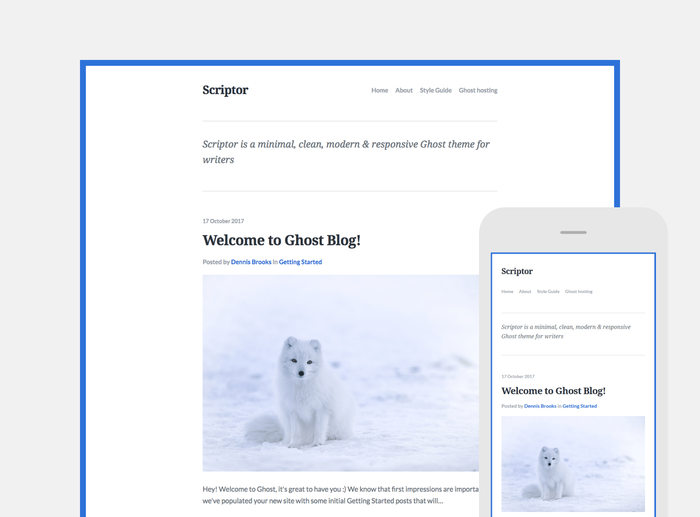

# Scriptor

**Scriptor** is a minimal, clean, modern & responsive Ghost theme for writers.

See a live demo of Scriptor [here](https://scriptor.justgoodthemes.com/).

## Comments

**Scriptor** supports Ghost native comments. To enable the comments:

1.  In Ghost Admin, go to **Settings → Access** under the **Membership** section.
2.  Select the suitable option from the **Who can comment on posts?** dropdown.
3.  Save changes.

## Social Links

The social media links are displayed in the footer of the theme. To add social media links:

1.  In Ghost Admin, go to **Settings → Social Accounts** under the **General Settings** section.
2.  Enter the URLs to your social media profiles.
3.  Save changes.

## Footer Copyright Text

You can edit the copyright information in Ghost Admin.

1. In Ghost Admin, navigate to **Settings → Design & branding** under the **Site** section.
2. Click on **Customize**.
3. Switch to the **Theme** tab.
4. Enter the text in the **Copyright text** field.
5. Save changes.

## Translation

The **Scriptor** theme is ready for translations. You can find the default file in the `locales` folder. Copy `locales/en.json` to `locales/[language_code].json`. The `language_code` must be replaced with a valid code. You can edit the renamed translation file with any plain text editor.

To find more information on how to translate the theme, check [Ghost documentation](https://ghost.org/docs/themes/helpers/translate/).

## Adjusting Style

To customize the theme style, use the **Code Injection** tool:

1.  In Ghost admin, go to **Settings → Code injection** under the **Advanced** section.
2.  Click on **Open**.
3.  Place your CSS rules in the **Site Header** field.
4.  Save changes.

## Development

To start developing locally, you need to have Ghost installed on your machine. Please follow installation instructions provided in [Ghost documentation](https://ghost.org/docs/install/local/).

The theme stylesheet is located in `/assets/css/`.

## Theme Deploy with GitHub Actions

**Scriptor** includes the official [Deploy Ghost Theme](https://github.com/marketplace/actions/deploy-ghost-theme) GitHub Action. It deploys the theme from this GitHub repository to your Ghost site using the Ghost Admin API. To learn more, see Ghost’s [GitHub integration guide](https://ghost.org/integrations/github/) or this [Deploy Ghost Theme guide](https://justgoodthemes.com/resources/deploying-your-ghost-theme-using-github-actions/).

## Ghost Hosting

If you’re using GhostPro, you must be on the [Publisher plan](https://ghost.org/pricing/?via=tomas40). Custom or premium themes are not available on the [Starter plan](https://ghost.org/pricing/?via=tomas40).

## Theme Support

If you find any issues with the theme, please send us an [email](mailto:support@justgoodthemes.com) or create an [issue](https://github.com/JustGoodThemes/Scriptor-Ghost-Theme/issues) in the theme repo.

## Credits

- [Simple Icons](https://simpleicons.org/)
- [Reframe.js](https://github.com/yowainwright/reframe.js)

## Copyright & License

Copyright (c) 2015-2026 Just Good Themes - Released under the [MIT license](LICENSE).
