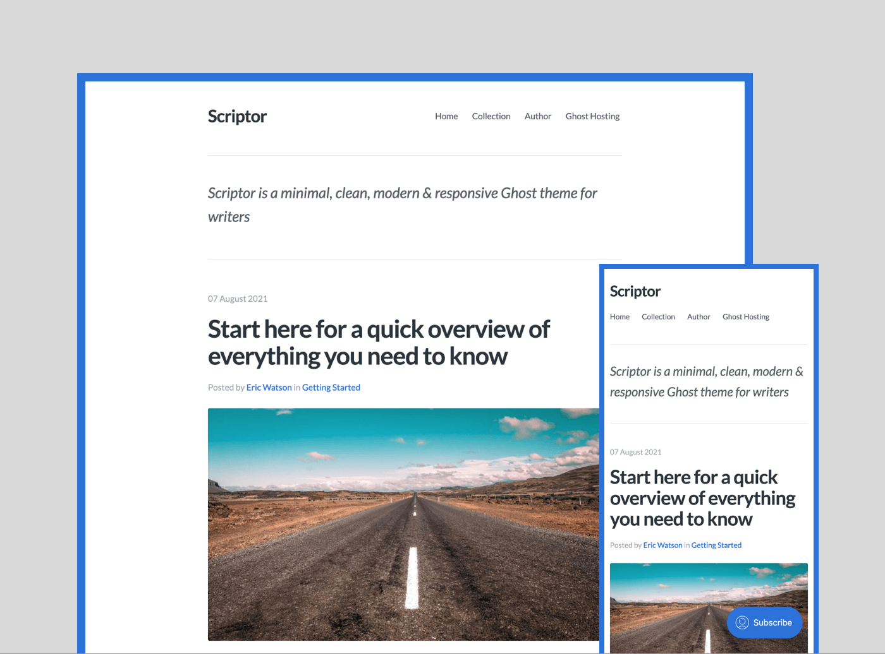

# Scriptor

Scriptor is a minimal, clean, modern & responsive Ghost theme for writers.

See a live demo of Scriptor [here](https://scriptor.justgoodthemes.com/).

[](https://scriptor.justgoodthemes.com/)

## Disqus Comments

Scriptor theme comes with Disqus commenting built-in, you just need to have a Disqus account (create it at [Disqus.com](https://disqus.com/)). To enable commenting, you just need to add your Disqus shortname to the "Site Header" field located in **Settings** → **Code injection** in your Ghost admin:

```
<script>
    const disqusShortname = 'YOUR_DISQUS_SHORTNAME';
</script>
```

If you wish to disable commenting, just remove the following lines from the `post.hbs` file located in the main theme folder:

```
{{!-- The tag below includes the theme comments - partials/comments.hbs --}}
{{> comments}}
```

## Social Links

To add Facebook and X (Twitter) links, navigate to **Settings** → **General**, click **Expand** next to **Social accounts** and enter the URLs of your Facebook and X (Twitter) profiles. Additional social links (Instagram, Bluesky, and LinkedIn) can be added via custom settings in Ghost admin.

If you want to add some other social media links, you can add them manually in the `footer.hbs` file located in the `partials` folder of the theme. For instance, if you want to add the link to your GitHub account, add the following code inside the `<div>` element with the class of `footer-social`:

```
<a href="URL_TO_YOUR_GITHUB_PROFILE" target="_blank" rel="noopener" aria-label="GitHub">
    {{> "icons/github"}}
</a>
```

To see the available icons, please check the `icons` folder of the theme located in the `partials` folder.

## Translation

The **Scriptor** theme is fully translatable. You can find the default file in the `locales` folder. Copy `locales/en.json` to `locales/[language_code].json`. The `language_code` must be replaced with a valid code. You can edit the renamed translation file with any plain text editor.

To find more information on how to translate the theme, check [Ghost documentation](https://ghost.org/docs/themes/helpers/translate/).

## Development

To start developing locally, you need to have Ghost installed on your machine. Please follow installation instructions provided in [Ghost documentation](https://ghost.org/docs/install/local/).

The theme stylesheet is located in `/assets/css/`.

## Theme Deploy with GitHub Actions

Scriptor has the [Deploy Ghost Theme](https://github.com/marketplace/actions/deploy-ghost-theme) Github action integrated. The purpose of the GitHub action is to take the theme from the GitHub repo and send it to your website. To learn more about Deploy Ghost Theme, please follow [this guide](https://justgoodthemes.com/resources/deploying-your-ghost-theme-using-github-actions/).

## Ghost Hosting

If you’re using GhostPro, you must be on the [Creator plan](https://ghost.org/pricing/?via=tomas40). Custom or premium themes are not available on the [Starter plan](https://ghost.org/pricing/?via=tomas40).

## Theme Support

If you find any issues with the theme, please send us an [email](mailto:support@justgoodthemes.com) or create an [issue](https://github.com/JustGoodThemes/Scriptor-Ghost-Theme/issues) in the theme repo.

## Credits

- [Simple Icons](https://simpleicons.org/)
- [Reframe.js](https://github.com/yowainwright/reframe.js)

## Copyright & License

Copyright (c) 2015-2024 Just Good Themes - Released under the [MIT license](LICENSE).
